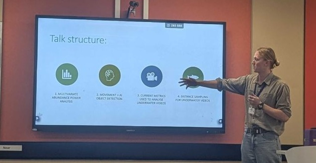
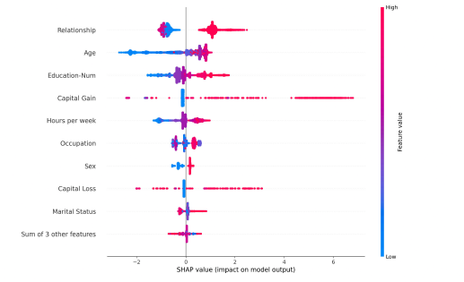
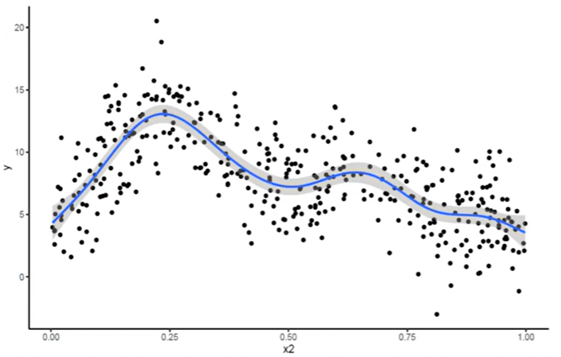

## Conference presentations

```{r,echo=FALSE}
#| out-width: "60%"
#| fig-align: left

```

### Invited Speaker

- **Australian Statistical Conference**, Perth, Australia, 2025
  - Mentor for statistical consulting session

### Contributed Speaker

- **Australian Fish Biology Conference**, Darwin, Australia, 2025
- **International Statistical Ecology Conference**, Swansea, Wales, 2025
- **UNSW Mathematics and Statistics Postgraduate Conference**, Sydney, Australia, 2023, 2024
  - Peoples choice award for best presentation, 2024
- **UNSW 1 minute thesis competition**, Sydney, Australia 2022
  - 1st place in the School of Mathematics and Statistics
- **Statistical Ecology and Environmental Monitoring Conference**, Queenstown, New Zealand, 2017

### Upcoming talks

- **International Statistical Ecology Conference**, Mérida, México, 2027

## Recorded technical Seminars

**A SHAP in the Dark: Interpretable machine learning through SHAP values**, Monthly Seminar, UNSW Stats Central, 2026

:::::: columns
::: {.column width="40%"}
```{r, echo=FALSE}
#| out-width: "100%"
#| fig-align: center



```
:::

::: {.column width="3%"}
:::

::: {.column width="57%"}
Although machine learning algorithms perform well at prediction tasks, with large numbers of model parameters it can be difficult to untangle what is going on under the hood. In this talk I discuss how SHAP values can be used to interpret these black box models, with a brief introduction into effect sizes and machine learning in general. Particularly in research, interpretable machine learning is integral to their integration and usefulness.

[View Slides](https://d2xnkjysn6lg7q.cloudfront.net/files/unswPDF/1776923505725-statscental_seminar_slides_bm_16april2026.pdf) [View Recording](https://www.youtube.com/watch?v=bbPTcID6uY8)
:::
::::::

**Wiggly Worries: What to Do When Your Data Isn't Linear,** Monthly Seminar, UNSW Stats Central, 2025

:::::: columns
::: {.column width="40%"}
```{r, echo=FALSE}
#| out-width: "100%"
#| fig-align: center



```
:::

::: {.column width="3%"}
:::

::: {.column width="57%"}
What happens when your data doesn't play nice and the linearity assumption of traditional approaches cannot be satisfied? In this talk I discuss methods to deal with non-linear data, with some examples in R using splines with generalised additive models.

[View Recording](https://www.youtube.com/watch?v=QVWb2GXHAvg)
:::
::::::
