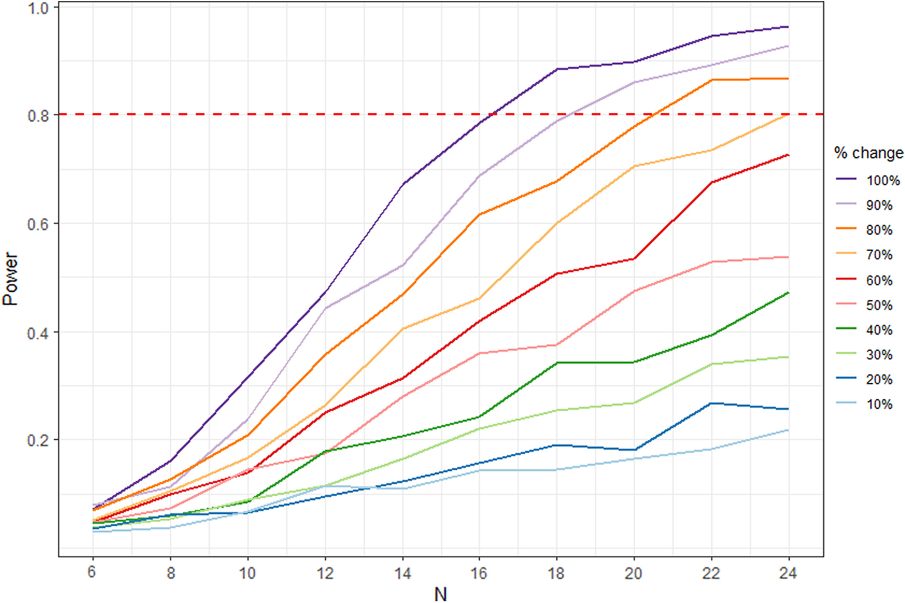
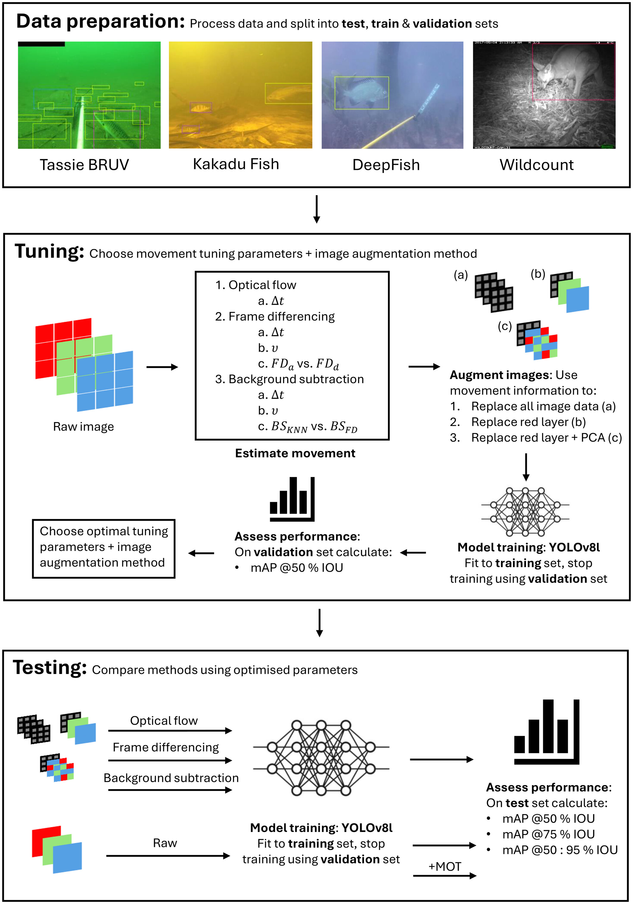

## Research profile

My research focuses on:

- Methods to improve the way in which ecologists analyse remote underwater videos to sample fish assemblages using distance sampling and AI object detection algorithms.
- Power analysis procedure for multivariate ecology data to answer study design questions.
- Applied computational statistics and machine learning research in collaboration with other research partners from ecology, medicine, pharmacology, public health and genomics.

I am currently working on:

- Analysing the statistical properties of methods used to analyse remote underwater videos using AI object detection algorithms and Monte Carlo Markov Chain simulations.
- Developing a novel method for estimating abundance whilst accounting for imperfect detection from stereo remote underwater videos using distance sampling.
- Obtaining bias-adjusted length frequency distributions from fish in stereo remote underwater videos using distance sampling.

For a full list of my published research, please refer to the [**Publications**](publications.qmd) tab.

## Publications of interest

### How many sites? Methods to assist design decisions when collecting multivariate data in ecology

```{r}
#| label: download-count
#| include: false

ecopower_downloads <- cranlogs::cran_downloads(
  packages = "ecopower",
  from = "2012-01-01",
  to = Sys.Date()
) |> dplyr::select(count) |>
  sum()
```

:::::: columns
::: {.column width="58%"}
Maslen, B., Popovic, G., Lim, M., Marzinelli, E., & Warton, D. (2023)

This paper develops a power-analysis framework for deciding how many sites are needed when collecting multivariate ecological abundance data. The approach uses a Gaussian copula model with factor-analytic structure, a realistic effect-size formulation and a computationally efficient critical-value method. The associated methods are implemented in the [`ecopower`](https://cran.r-project.org/package=ecopower) R package which is openly accessible from CRAN and has been downloaded `r format(ecopower_downloads, big.mark = ",")` times to date.

[Read the paper](https://doi.org/10.1111/2041-210X.14094) · [ecopower](https://cran.r-project.org/package=ecopower)
:::

::: {.column width="2%"}
:::

::: {.column width="40%"}
```{r, echo=FALSE}
#| out-width: "100%"
#| fig-align: center



```
:::
::::::

### The motion picture: leveraging movement to enhance AI object detection in ecology

:::::: columns
::: {.column width="58%"}
Maslen, B., Popovic, G., Wang, D., Jansen, A., & Warton, D. (2025)

This study evaluates whether movement information can improve automated object detection in ecological imagery. Across four datasets containing more than 35,000 annotated images from marine, freshwater and terrestrial habitats, the study compares frame differencing, background subtraction, optical flow and multi-object tracking. Movement-based methods were most useful for smaller studies and rarer species, while simple frame differencing generally performed best among the movement-based approaches.

[Read the paper](https://doi.org/10.1002/ece3.71996) · [Code](https://github.com/BenMaslen/MCD) · [Benchmark data](https://doi.org/10.5061/dryad.sbcc2frf7)
:::

::: {.column width="2%"}
:::

::: {.column width="40%"}
```{r, echo=FALSE}
#| out-width: "80%"
#| fig-align: center



```
:::
::::::

## Supervision

I am not currently supervising any research students, however, if you are interested in one of the below research projects, or have your own research project idea and are looking for a supervisor, feel free to [get in touch](mailto:b.maslen@unsw.edu.au).

### Potential student projects

- Develop methods to obtain unbiased fish length frequencies from stereo underwater videos using distance sampling to obtain probability of detection per differently sized fish.
- Estimate bias from baiting in underwater videos using simulation, and undergo power analysis of unbaited videos using AI object detection to show unbaited videos analysed through AI can achieve similar power to baited videos which have issues with bias.
- Develop methods to convert point annotation data from manually analysed videos to large scale object detection algorithms. 
- AI object detection of stereo videos to automate distance sampling abundance estimation.
- Model uncertainty from AI predictions in subsequent downstream abundance regression models.
- Combine multiple sources of shark data (e.g. from commercial bycatch, drumline and tagging, human-shark mortality rates, coastal drone observations, Close-Kin Mark-Recapture abundance estimates) in joint mixture models to look at how shark abundance has changed over time.
- Use deep learning algorithms to produce large scale species distribution models on citizen science data (e.g. [ebird](https://ebird.org/) or [Inaturalist](https://www.inaturalist.org/)) and use explainable AI (e.g. SHAP values) to gain inference.
- Partition $\beta$-diversity (species compositional changes across sites) into 'nestedness' & 'turnover' components using multivariate generalised mixed models. 


### Past supervision

School of Mathematics and Statistics, UNSW (2026) – Supervisor for two groups of Masters students taking the Data Science and Decisions Project course (DATA5925 & MATH5925), guiding students to independently research and analyse a VISA tribunal outcomes dataset, tackling real world data science problems.

Stats Central, UNSW (2018-2019, 2021-2026) – I have met and helped with the supervision of over 180 honours and postgraduate research students, guiding them through the experimental design and analysis phase of their research projects in collaboration with their academic supervisors.

## Collaboration

I welcome conversations about interdisciplinary research involving statistical design, data science, modelling, prediction, uncertainty quantification or reproducible analysis, particularly with applications in ecology. Feel free to [get in touch](mailto:b.maslen@unsw.edu.au) if you are interested in collaborating on a research project.
